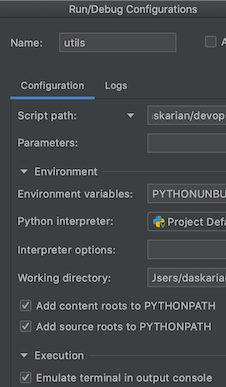

# WorldOfGames

Hi! welcome to my game :)

## Prerequisites

- python 3.8 and above

## Instructions

**Running in terminal**

1. `> cd <repo_dir>`
2. `> python MainGame.py`

**Running via PyCharm**

1. Make sure to Enable the "Emulate terminal in output console" option in your PyCharm "Run configurations".

   

   

2. Run MainGame.py